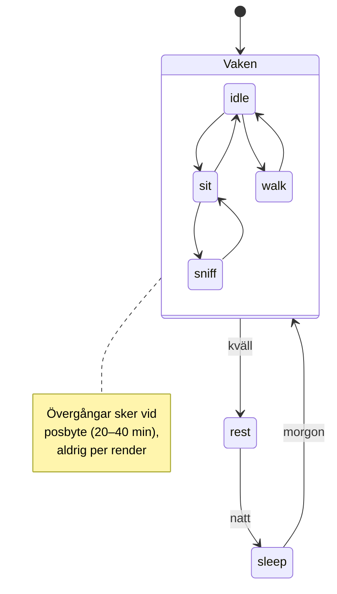

# COMPANION SYSTEM — designförslag

> Status: **förslag, inte implementerat.** Beskriver hur det befintliga
> följeslagarsystemet växer till ett generellt Companion-system där räv, björn,
> uggla och hjort är olika följeslagare i samma arkitektur.

Läs `docs/NORTH_STAR.md` först. Allt nedan är underordnat den.

---

## Utgångspunkt: det mesta finns redan

Det här är inte ett nybygge. Systemet är redan generiskt i sin kärna:

| Redan byggt | Var |
| --- | --- |
| `CompanionId = 'fox' \| 'bear' \| 'wolf'` | `companionPoseManifest.ts` |
| Posmanifest med `base`/`overlay`, dagparter, vikter, `sceneAdjustment` | `companionPoseManifest.ts` |
| **Posbyte var 20–40 min**, persistent i `localStorage` | `COMPANION_POSE_CHANGE_MIN_MS` / `MAX_MS` |
| Viktat slumpval + scenpositioner (`foreground-right`, `shore-near`, `shore-far`) | `companionPoseState.ts` |
| Kanonisk tillståndsordlista (9 states) | `companionStateMachine.ts` |
| Mikrorörelser mellan posbyten (~5 % duty cycle) | `world/companionBehaviour.ts` |
| Återkomst- och reflektionsreaktion | `companionPoseState.ts` |
| Årstid + tid på dygnet i världen | `worldScene.ts`, `progressCompanion.ts` |

**Kadenskravet 20–40 minuter är alltså redan uppfyllt** och posen är persistent
per companion — den byts inte per render.

### Vad som faktiskt saknas

1. **Väder** — finns ingenstans i companion-koden.
2. **Årstid når inte fram** — `worldScene.ts` känner årstid, men poseurvalet gör inte det.
3. **Personlighet** — alla följeslagare beter sig identiskt; bara bilderna skiljer.
4. **`morning` tappas** — världen har fyra dagpartier, posmanifestet bara tre.
5. **Allt i en fil** — 300+ rader manifest där varje ny följeslagare ökar risken för krockar.

Förslaget nedan åtgärdar de fem punkterna utan att skriva om något som fungerar.

---

## 1. Pose-systemet

Behåll dagens tvålagersmodell — den är rätt:

- **Baspose** — vad följeslagaren *gör* (står, sitter, dricker, sover). Byts var 20–40 min.
- **Overlay** — kortlivad gest ovanpå basposen (blink, gäspning, öronryck). Sekunder.
- **Beteende** — CSS-transform för de följeslagare som saknar overlay-bilder.

**Tillägg:** utöka `CompanionPose` med två valfria filter. Båda är valfria, så
varje befintlig pose fortsätter fungera oförändrad.

```ts
type CompanionPose = {
  // ...befintliga fält
  seasons?: CompanionSeason[];   // utelämnad = alla årstider
  weather?: CompanionWeather[];  // utelämnad = allt väder
};
```

Det låter `fox-winter-sleep-*.png` och `fox-rain-sheltering.png` — bilder som
redan ligger i `static/images/avatars/presets/` men aldrig används — komma in
utan ny grafik.

---

## 2. State machine

Dagens `companionStateMachine.ts` mappar pose-id → ett av nio tillstånd. Den
modellen är sund och behålls. Den är dock i praktiken en **ren översättning**,
inte en tillståndsmaskin med övergångar — och det är rätt nivå: följeslagaren
ska inte "köra ett program", den ska bara *vara* någonstans.

Föreslagen utökning: gör mappningen **härledd** i stället för en handskriven
tabell per pose-id. Varje pose deklarerar sitt tillstånd själv:

```ts
type CompanionPose = {
  state: CompanionState;  // 'idle' | 'sit' | 'sleep' | ...
};
```

Då slipper varje ny följeslagare lägga till rader i `BASE_POSE_ID_TO_STATE`,
och en glömd rad kan inte längre tyst falla tillbaka till `idle`.



Övergångarna är alltså **inte** händelsestyrda — de faller ut ur att en ny pose
väljs när den gamla löpt ut. Det är avsiktligt: en följeslagare som "reagerar"
snabbt känns som ett gränssnitt, inte som ett djur.

---

## 3. Hur poser väljs

En ren, testbar pipeline. Varje steg är ett filter; slumpen kommer sist.

```
kandidater = alla poser
  → filter: companionId
  → filter: role === 'base'
  → filter: dagpart matchar
  → filter: årstid matchar        (ny)
  → filter: väder matchar         (ny)
  → filter: har en tillåten scenposition
  → viktning: pose.weight × personlighetsmultiplikator   (ny)
  → viktat slumpval
```

**Degraderingsregel (viktig):** om ett filter tömmer listan ska filtret
*släppas*, inte träffa ett fallback-läge. Ordning: väder släpps först, sedan
årstid, sist dagpart. En följeslagare utan vinterbilder visar hellre sin vanliga
sittpose än fel pose eller ingen alls. Dagens `getFallbackPose` behålls som sista
utväg.

Detta är rent funktionellt och kan testas utan webbläsare — samma mönster som
`speech.ts`.

---

## 4. Hur ofta poser får bytas

Oförändrat: **20–40 minuter**, slumpat per byte, persistent i `localStorage` med
utgångstid. Posen överlever sidladdning och flikbyte.

Föreslagna förtydliganden:

- **Personlighet skalar intervallet.** Björnen sitter längre än räven (se §7).
- **Dagpartsbyte bryter posen** — det gör det redan idag (lagrad `daypart`
  jämförs). En räv som somnat ska inte stå kvar sovande in på morgonen.
- **Aldrig byte medan sidan är synlig och användaren tittar.** Idag kan en pose
  hoppa mitt framför användaren när timern löper ut. Förslag: när intervallet
  gått ut, vänta till nästa `visibilitychange` eller sidmontering. Platsen ska
  förändras *mellan* besöken — "var det verkligen så här sist?" — inte inför
  ögonen på någon. Detta är den enskilt största trovärdighetsvinsten.

---

## 5. Hur tid på dygnet påverkar

Idag: `day` / `evening` / `night` — medan världen räknar med fyra
(`ProgressCompanionDayState` har även `morning`).

**Förslag:** lyft `CompanionPoseDaypart` till fyra värden så att `morning`
slutar kollapsa in i `day`.

| Dagpart | Karaktär |
| --- | --- |
| `morning` | vaknar, sträcker sig, dricker — låg energi på väg upp |
| `day` | mest varierat; går, nosar, tittar ut |
| `evening` | sitter vid sjön, vilar, gäspar |
| `night` | sover; endast `sleep`-overlays (öronryck, svansrörelse) |

Migrering är bakåtkompatibel: poser som idag har `['day']` får `['morning', 'day']`
så inget beteende försvinner förrän morgonspecifika bilder finns. Bilderna finns
redan (`fox-morning-*.png`, `08_sunrise_scene.png`).

**Sömnkravet:** natt ska garanterat välja en pose med stängda ögon. Det säkras
med ett test som misslyckas om någon companion saknar `night`-baspose — hellre
ett rött test än en följeslagare som stirrar rakt fram hela natten.

---

## 6. Hur väder påverkar

Väder finns inte i koden alls idag, så det behöver en källa. Tre alternativ:

| Alternativ | För | Emot |
| --- | --- | --- |
| **A. Deterministiskt pseudoväder** (hash på datum + plats) | Ingen API-kostnad, ingen risk, samma väder för alla, testbart | Inte "riktigt" väder |
| B. Riktig väder-API på användarens ort | Verklig koppling till utsidan | Kräver platsdata (integritet), API-nyckel, felhantering, cache |
| C. Följer årstid + slump | Enklast | Känns godtyckligt |

**Rekommendation: A.** Ett stabilt pseudoväder som ändras långsamt (samma väder
i flera timmar) ger allt North Star efterfrågar — att platsen känns egen och
levande — utan att kräva användarens position. Det kan bytas mot B senare bakom
samma gränssnitt.

Väderlägen hålls medvetet få: `clear`, `rain`, `snow`, `fog`. Vädret påverkar
**pose-urval** (`fox-rain-sheltering.png`) och kan senare påverka världens
effektlager, men får aldrig blockera en pose helt — se degraderingsregeln i §3.

---

## 7. Personlighet — hur följeslagarna skiljer sig

Kärnidén: **samma tekniska grundsystem, olika temperament.** Personlighet är
ren data, inte kod — en profil per följeslagare.

```ts
type CompanionPersonality = {
  /** Skalar 20–40 min-intervallet. <1 = byter oftare. */
  poseIntervalScale: number;
  /** Skalar mikrorörelsernas frekvens. */
  motionScale: number;
  /** Extra vikt på vissa tillstånd, t.ex. { sit: 1.6, walk: 0.4 }. */
  stateBias: Partial<Record<CompanionState, number>>;
  /** Dagparter då följeslagaren är som mest aktiv. */
  activeDayparts: CompanionPoseDaypart[];
  /** Chans att alls synas i scenen (hjorten är sällsynt). */
  presenceChance: number;
};
```

| Följeslagare | Temperament | Profil |
| --- | --- | --- |
| 🦊 **Räv** | Nyfiken, rör sig mer, tittar mot sjön, blinkar ofta | `poseIntervalScale: 0.85`, `motionScale: 1.3`, bias mot `walk`/`sniff`/`look-*` |
| 🐻 **Björn** | Lugn, sitter länge, rör sig sparsamt, utstrålar trygghet | `poseIntervalScale: 1.4`, `motionScale: 0.6`, bias mot `sit`/`rest` |
| 🦉 **Uggla** | Aktiv kväll och natt, observerar | `activeDayparts: ['evening','night']`, bias mot `idle`/`look-*`, nästan aldrig `walk` |
| 🦌 **Hjort** | Försiktig, syns sällan, rör sig mjukt | `presenceChance: 0.55`, `motionScale: 0.7`, bias mot `idle`/`look-*` |

Det gör valet av följeslagare till ett **val av stämning**, inte ett skinn — och
kostar ingen ny arkitektur. Ugglan bryter dessutom mönstret elegant: en värld där
någon är vaken på natten känns annorlunda att återvända till på kvällen.

---

## 8. Hur framtida följeslagare passar in

Checklista för att lägga till en ny följeslagare (uggla, hjort, …):

1. Lägg till id:t i `CompanionId`.
2. Skapa `companions/<id>.ts` med posarray + personlighetsprofil.
3. Registrera modulen i ett `COMPANION_REGISTRY`.
4. Lägg till bilder under `static/images/avatars/presets/<id>/`.
5. Kör manifesttestet — det ska klaga om en dagpart, ett tillstånd eller en
   scenposition saknas.

**Ingen ändring i urvalslogik, state machine eller komponenter.** Det är måttet
på att arkitekturen håller.

Ett **manifest-kontraktstest** föreslås som grind: för varje registrerad
följeslagare ska det finnas minst en baspose per dagpart, minst en `night`-pose
med stängda ögon, och varje pose-id måste finnas i minst en scenpositions
`allowedPoseIds` (annars filtreras posen bort osynligt — en fälla som redan
finns i koden idag).

---

## 9. Filer som påverkas

**Ändras:**

| Fil | Ändring |
| --- | --- |
| `src/lib/companionPoseManifest.ts` | Delas upp per följeslagare; `seasons`/`weather`/`state` läggs till i typen |
| `src/lib/companionPoseState.ts` | Filterpipeline med årstid/väder + degraderingsregel; personlighet skalar intervall |
| `src/lib/companionStateMachine.ts` | Tillstånd härleds från posen i stället för tabell |
| `src/lib/world/companionBehaviour.ts` | `motionScale` från personlighet |
| `src/lib/components/CompanionPose.svelte` | Skjut upp posbyte till dolt läge/montering |
| `src/lib/progressCompanion.ts` | Exponera årstid/dagpart till poseurvalet |

**Nya:**

| Fil | Innehåll |
| --- | --- |
| `src/lib/companions/{fox,bear,wolf}.ts` | Poser + personlighet per följeslagare |
| `src/lib/companions/registry.ts` | `COMPANION_REGISTRY` |
| `src/lib/companionPersonality.ts` | Typ + profiler |
| `src/lib/companionWeather.ts` | Deterministiskt pseudoväder |
| `src/lib/companionManifest.test.ts` | Kontraktstest (§8) |

**Berörs indirekt:** `src/routes/framsteg/+page.svelte`, `CompanionAvatar.svelte`,
`CompanionSelector.svelte`, `CompanionFriend.svelte`.

**Ingen bildfil behöver skapas** i första steget — förslaget aktiverar bilder som
redan ligger oanvända i `static/images/avatars/presets/`.

---

## 10. Föreslagen ordning

1. Kontraktstest + uppdelning per följeslagare *(ingen beteendeförändring)*
2. `morning` som egen dagpart
3. Personlighetsprofiler
4. Årstid i poseurvalet
5. Uppskjutet posbyte (§4)
6. Väder
7. Uggla + hjort som bevis på att arkitekturen håller

Steg 1–2 är rent strukturella och riskfria. Först i steg 3 ändras något
användaren kan känna.

---

## Öppna frågor

1. **Väderkälla** — deterministiskt pseudoväder (A) eller riktig API (B)?
2. **Hjortens `presenceChance`** — om hjorten ibland inte syns alls, ska platsen
   då vara tom, eller ska en annan följeslagare synas i stället? Tom plats är
   mer trovärdig men kan uppfattas som en bugg.
3. **Vargen** — finns i koden med en enda pose. Ska den byggas ut eller fasas ut?
4. **Undermapp per följeslagare** — `presets/fox/` förenklar, men kräver att
   alla referenser uppdateras samtidigt.
