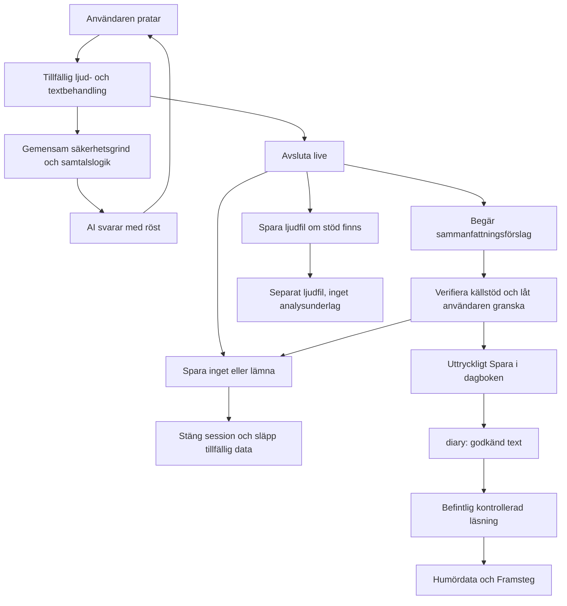

# Live-röstsamtal: flyktigt samtal, frivilligt minne

Status: beslutad produktprincip och konkret implementationsplan, 2026-09-03. Live-funktionen är inte byggd i detta steg. Inventeringen gäller repot på `7cb3f10` med den lokala ändringen av chattens samtalsstil. Produktionsdatabas, Storage-inställningar och leverantörers faktiska retention är inte verifierade här.

## 1. Produktprincip

**Live är flyktigt. Dagboken är minnet. Humöranalysen använder endast material som användaren aktivt valt att spara.**

Live ska fungera som ett röstsamtal: användaren pratar och AI svarar med röst. Ingen löpande texttråd behöver visas. Tillfällig transkribering får användas för samtalskontext, säkerhet och ett uttryckligen begärt sammanfattningsförslag. Den får inte bli permanent chatthistorik.

- Avslut, tystnad, avbrott, navigering, timeout eller misslyckad anslutning sparar ingenting från samtalet automatiskt.
- Efter avslut erbjuds **Spara en kort sammanfattning i dagboken**, **Spara inget** och, först när stöd finns, **Spara ljudfilen**. Inget sparval är förvalt.
- Valet av sammanfattning öppnar ett förslag att granska. Först ett separat tryck på **Spara i dagboken** skapar en dagboksrad. Det ska gå att rätta eller stryka innehåll och avstå.
- Rösten är ett gränssnitt. Tonläge, tempo, prosodi, ljudegenskaper och biometriska signaler får aldrig användas för humörpoäng, diagnoser eller slutsatser om psykiskt tillstånd. Teknisk detektion av tal/tystnad för turordning får inte återanvändas för sådana slutsatser.
- Säkerhetsregler och krishänvisning gäller även i live. Ett krissvar utlöser inte automatisk lagring.
- Principen gäller framtida live, både med och utan inloggning. Den ändrar inte dagens vanliga textchatts lagringsmodell.

## 2. Verifierat nuläge och återanvändning

| Del | Befintlig implementation | Betydelse för live |
| --- | --- | --- |
| Röstinmatning | [VoiceInput.svelte](../src/lib/components/VoiceInput.svelte) använder `SpeechRecognition`/`webkitSpeechRecognition`, svenska och tillfälliga/finala transkript. [voice-auto-send.ts](../src/lib/ai/voice-auto-send.ts) skickar efter 1 500 ms när villkoren är uppfyllda. | Dagens funktion är diktering till chattens textfält, inte ett separat live-läge. Återanvänd hanteringen av sena händelser, avbrott och turordning. Webbläsar-API:t bevisar inte lokal ljudbehandling eller en viss retention. |
| Uppläsning | [ChatWindow.svelte](../src/lib/components/ChatWindow.svelte) använder `speechSynthesis`; [speech.ts](../src/lib/ai/speech.ts) väljer svensk röst och väntar på röstladdning. | Språkval och avbrottsmönster kan återanvändas. Själva chattkomponenten har lagringsbiverkningar. |
| Vanlig chatt | `ChatWindow` visar meddelanden och sparar inloggad historik i localStorage och `chat_history`. [api/chat](../src/routes/api/chat/+server.ts) skriver `conversations` och `messages`, läser minnes-/dagbokskontext och kan anropa `refreshUserMemories`. Gästgrenen sparar inte chatthistorik. | Återanvänd inte `ChatWindow.send()`, dess persistenseffekt eller den inloggade POST-grenen för live. Gästgrenen är inte ett sätt att kringgå korrekt autentisering för live. |
| AI | `_buildDynamicSystemPrompt` och `_buildSupportChatRequest` bygger chattinstruktioner. [text-generation.ts](../src/lib/server/ai/text-generation.ts) och dess kontrakt/providergräns hanterar textgenerering. [safety-instructions.ts](../src/lib/server/ai/safety-instructions.ts), [crisis-guard.ts](../src/lib/ai/crisis-guard.ts) och [reassurance-pattern.ts](../src/lib/ai/reassurance-pattern.ts) äger gemensamma skydd. | Återanvänd riktiga produktbyggare och säkerhet, med testprovider. Ett ljud-/sessionskontrakt saknas; textinterfacet ska inte låtsas vara ett ljudinterface. |
| Dagbok | [api/diary/create](../src/routes/api/diary/create/+server.ts) validerar text, verifierar `auth.getUser()`, sätter `user_id` och skriver endast `diary`. [types.ts](../src/lib/types.ts) och [state/diary.ts](../src/lib/state/diary.ts) beskriver datan. [dagbok/checkin](../src/routes/dagbok/checkin/+page.svelte) har explicit sparning, valfritt humör och media. | Spara godkänd sammanfattning genom samma dagboksskrivning. Ingen separat sammanfattningstabell behövs. |
| Utkast | [GuestQuickEntry.svelte](../src/lib/components/GuestQuickEntry.svelte) autosparar lokalt; [diary-draft.ts](../src/lib/diary-draft.ts) använder localStorage och sessionStorage. | Live-utkast får inte lämnas till dessa flöden före godkänd sparning, inte heller via URL-parametrar. Återanvänd enbart rena redigeringsdelar när de kan separeras från autosparandet. |
| Humörtidslinje | [stats-timeline](../src/routes/api/diary/stats-timeline/+server.ts) läser `created_at, mood` ur användarens `diary`. | En textsammanfattning utan egen humörregistrering ska inte skapa en siffra i grafen. |
| Framsteg | [insights](../src/routes/api/diary/insights/+server.ts) läser `created_at, mood, text, tags`, användaravgränsat, för 30/90/180 dagar, max 500 rader. [progress-analysis.ts](../src/lib/server/progress-analysis.ts) räknar teman och samband deterministiskt. [framsteg](../src/routes/framsteg/+page.svelte) presenterar resultatet. | Sparad sammanfattning kan räknas som textunderlag via samma fråga. Inga ljudfiler, chattabeller, levande sessioner eller nya AI-anrop behövs för den analysen. |
| Stöd och citat | Samma endpoint anropar [diary-support-suggestions.ts](../src/lib/server/diary-support-suggestions.ts). Stödvyn kan innehålla korta citat från sparade texter. [diary-insight-analysis.ts](../src/lib/server/diary-insight-analysis.ts) innehåller även andra analys-/berättelsebyggare; alla används inte av dagens Framsteg-endpoint. | Källa måste följa med så att en sammanfattning inte presenteras som användarens ordagranna tal. Behåll skydd, evidenskrav och befintlig rankning. |
| Samtycke | [ai-consent.ts](../src/lib/server/ai-consent.ts) använder serverägda `user_ai_consents`, exakt scope/version och avvisar vid saknat, återkallat eller felaktigt samtycke samt DB-fel. Chatt, dagboksreflektion, veckosammanfattning och dagens fråga har skilda scope. | Återanvänd tabellen och hjälparna. Mikrofontillstånd och ett gammalt textchattsamtycke är inte ett nytt samtycke till ljudbehandling eller sparning. |
| Supabase/media | [diary.sql](../supabase/diary.sql) anger ägarstyrd RLS. Extra fält finns för bild, video och frågeursprung. [diary_video.sql](../supabase/diary_video.sql) beskriver privat video. [diary_image_url.sql](../supabase/diary_image_url.sql) och [upload](../src/routes/api/diary/upload/+server.ts) avser publika bilder. | Ljudlagring för live saknas. Bildbucket och bildendpoint är inte en mall för känsligt ljud. Verifiera verkliga grants, RLS och buckets innan framtida driftsättning. |

Sökning i `src`, `docs` och `supabase` hittade ingen separat live-route, WebRTC-/WebSocket-session eller kontinuerlig röstsamtalstjänst. `VideoRecorder.svelte` är videoinspelning, inte AI-live. `tests/ai-evals/live-*` betyder tester mot en riktig modell, inte live-röstsamtal. Storify har ett transkriptbaserat dagboksflöde men andra instruktioner och en separat providerkoppling; det ska inte återanvändas som live-sammanfattare.

## 3. Minsta framtida arkitektur



### Samtalet

Bygg senare en liten separat live-vy och flyktig sessionshantering. Den ska inte montera `ChatWindow` dolt eller skicka liveinnehåll genom dess sparande endpoint. All data stannar i aktivt minne tills ett uttryckligt sparbeslut finns. Varken `conversations`, `messages`, `chat_history`, `user_memories`, `diary`, embeddings eller Storage får användas som sessionsbuffert.

När live verkligen byggs: flytta befintliga rena promptbyggare till exempelvis `src/lib/server/ai/support-chat.ts`, utan att kopiera prompten. Vanlig chatt och live anropar samma byggare. Bevara exporter eller uppdatera befintliga evalimporter så att tester fortsatt använder produktvägen. Gör inte denna flytt i förväg. Live lämnar bara aktiv sessionshistorik; ingen automatisk läsning eller uppdatering av långtidsminnet. Ett eventuellt senare val att använda sparad dagbokskontext kräver en egen tydlig produktregel och befintliga läsgrindar.

Första live-versionen kan använda taligenkänning → gemensam textmodell → uppläsning, med turtagning och avbrott utan texttråd i gränssnittet. Transporten avgör inte om det är ett röstsamtal. Välj inte en direkt ljud-till-ljud-provider förrän säkerhets- och datagränserna kan upprätthållas där.

`resolveDeterministicRiskGuard` ska granska tillgängligt användarinnehåll innan en generativ samtalsrespons begärs eller spelas upp. Taligenkänning kan behöva behandla ljud innan text finns; den behandlingen kräver rätt samtycke och får inte samtidigt generera ett okontrollerat samtalssvar. Säkerhetsgrinden kontrollerar både egenrisk och tredjepartsrisk. Skyddet mot upprepat bekräftelsesökande behöver tillfällig historik även när inget sparas. Krisresponsen ska kunna höras och visas som en kort säkerhetshänvisning, oberoende av en vanlig texttråd. Om en framtida native-ljudtransport kan spela upp modellens svar före grinden är den inte redo för lansering.

### Tillfälliga data och avslut

Föreslagna övre gränser för första implementationen: högst 20 minuters aktiv session, högst 5 minuter för efterval/granskning och högst 32 000 tecken i sammanfattarens användarunderlag. Bekräfta gränserna vid transportval; tester ska använda explicit konfiguration, inte oändlig retention.

- Aktiv session: endast begränsade RAM-buffertar. Tillfälliga turer har roll och lokalt ID så att AI-tal aldrig blir faktakälla. Ingen sessionsåterställning från disk.
- Vid normalt avslut: stoppa mikrofon, uppspelning och transport omedelbart. Ett begränsat användarunderlag får finnas i RAM för eftervalet i högst 5 minuter. Förklara i liveinformationen att det försvinner om användaren lämnar eller väljer bort sparning.
- Skapa sammanfattningsförslaget först när användaren begär det. Servern håller källtext bara under denna begäran och släpper den i `finally`. Klienten släpper råunderlaget när förslaget kommit tillbaka; bara granskningsutkastet återstår till tidsgränsen eller användarens val.
- Spara inget, stängd vy, utloggning, återkallat samtycke eller utgången tidsgräns: avbryt arbete, gör sena callback-svar verkningslösa, släpp buffertar och återkalla objekt-URL:er. Ingen bakgrundssammanfattning eller senare sparning. Det innebär inte ett löfte om fysisk överskrivning av JavaScript-minne.
- Nätverksavbrott: ingen automatisk sammanfattning, uppladdning eller återhämtning från historik. Vid återanslutning krävs en ny uttrycklig start. Saknat underlag kan inte återställas.
- För stort/ofullständigt underlag: avbryt sammanfattningsförslaget med ett begripligt besked eller ange tydligt vilken del det omfattar. Påstå inte att hela samtalet täcks. Spara inte rådata för att kringgå gränsen.
- Inga innehållsloggar, analytics-payloads, crashrapporter, session replay, beständiga köer, cacheposter, URL-parametrar, localStorage, sessionStorage, IndexedDB eller service-worker-cache med liveinnehåll. Sätt `Cache-Control: no-store` på berörda HTTP-svar och kontrollera proxy-/providerloggning separat.
- En RAM-buffert i applikationen bevisar inte leverantörens retention. Verifiera leverantörsavtal, region, loggning, sessionsstängning och retention för både STT, modell och TTS innan känsligt liveinnehåll används. Lova inte noll leverantörslagring utan verifiering.

## 4. Sammanfattningens innehåll och verifiering

Första versionens förslag: 1–3 korta meningar, högst 100 ord, neutral text som går att granska. Bara kategori 1 sparas: sådant användaren faktiskt uttryckte. Kategori 2, modellens tolkningar, ingår inte i dagbokstext, taggar eller humördata. Därmed behövs inget permanent tolkningsfält i V1. Om tolkningar senare visas måste de vara tydligt åtskilda och uteslutna från normal analys.

Tillåtet är egna ämnen, explicit uttryckta känslor/mående, berättade händelser och teman som verkligen återkom. Återkommande inom ett samtal är inte samma sak som ett återkommande livsmönster. Bevara negation, vem något gäller, tidsangivelser, osäkerhet och senare rättelser.

Förbjudet är att diagnosticera, lägga till känslor, förklara orsaker, dra kausala slutsatser, göra egen sentimentbedömning eller förvandla modellens förslag till användarens berättelse. En användares egen osäkra orsakstanke får inte bli ett faktapåstående. Sammanfattningen får inte fyllas ut när underlaget är tunt.

Exempel med underlaget ”Jag sov dåligt i natt. Jag känner mig trött. Jag träffade min syster i går”:

> Du berättade att du sov dåligt i natt och känner dig trött. Du träffade din syster i går.

Inte: ”Sömnbristen gjorde dig nedstämd, men familjen hjälpte dig att återhämta dig.”

Använd ett separat use case `live-summary` inom det befintliga AI-lagret, exempelvis `src/lib/server/ai/live-summary.ts`, via `AITextProvider`. Återanvänd gemensamma säkerhetsinstruktioner men inte dagboksreflektionens instruktion att spegla känslor eller Storifys berättarröst.

Ett tillfälligt resultatkontrakt kan vara:

```ts
type LiveSummaryDraft = {
  statements: Array<{
    kind: 'topic' | 'expressed_feeling' | 'reported_event';
    text: string;
    evidence: Array<{ userTurnId: string; quote: string }>;
  }>;
};
```

Detta är ett planerat bearbetningsformat, inte en databasmodell. Varje påstående måste ha stöd i en faktisk användartur. Assistentens förslag, instruktioner i transkriptet och andra sessionsanvändares data är aldrig bevis.

Validera schema, längd, tillåtna fält, turernas ägarskap/roll och att evidenscitaten finns. **Ett matchande citat bevisar inte att en fri omformulering är korrekt.** Börja därför med varsamt valda, sammanhängande användarutsagor och fast neutral inramning där det går; testa betydelsen, inte bara citatmatchningen. Bevara hela betydelsebärande uttryck, exempelvis ”inte orolig”, och rättelser. Om källstödet inte kan avgöras ska förslaget underkännas eller påståendet utelämnas; användaren kan skriva en egen anteckning eller avstå. Granskning är ytterligare en kontroll, inte en ersättning för tester av modellens faktastöd.

Rättelser i granskningsytan är användarens egna uppgifter. Presentera inte användarens tillagda text som verifierat ordagrant samtalsinnehåll. Källmarkeringen beskriver ursprunget som ett granskat sammanfattningsförslag, inte en garanti om modellens sanningshalt. Evidenscitat, fullständiga turer och råtranskript sparas inte tillsammans med sluttexten.

## 5. Föreslagen datamodell och sparväg

### Sammanfattning i befintliga `diary`

| Fält | Förslag |
| --- | --- |
| `id` | Befintlig UUID. Skapa ett stabilt ID för det konkreta sparförsöket och återanvänd vid retry; ingen extra sessionsrad behövs. |
| `user_id` | Befintligt fält, alltid härlett från verifierad användare på servern. |
| `text` | Endast den text användaren granskat och valt att spara. |
| `mood` | `null` om användaren inte själv väljer en humörregistrering. Får aldrig härledas från röst eller AI-text. |
| `tags` | `null` som standard. Endast användarvalda taggar, inga dolda psykologiska etiketter. |
| `created_at` | Befintlig servertid för sparningen. Beskriv den som sparningsdatum, inte som säker tidpunkt för alla händelser i texten. |
| **`source_kind`** | Ett nytt fält, föreslaget `text NOT NULL DEFAULT 'diary'`, med tillåtna värden `diary` och `live_summary`. `diary` beskriver befintliga blandade inlägg, inte att alla är manuellt skrivna. |
| Övriga befintliga fält | `image_url`, `video_path`, `prompt_question`, `daily_question_id` förblir `null` för live-sammanfattning. |

Endast `source_kind` behöver läggas till för första sammanfattningsversionen. Det möjliggör ärlig källmärkning och hantering av citat. Lägg inte till `transcript`, ljudfeatures, modellhumör, beständigt `live_session_id`, evidenscitat eller en generell innehålls-JSON. `source_kind` är ursprungsmetadata, inte en behörighetskontroll.

Utöka senare `/api/diary/create` och dess typer med en tydlig sparoperation för live-sammanfattning, exempelvis `action: 'save_live_summary'`, `entryId`, `text`, `confirmed: true` och valfri användarvald `mood`. Detta skickas endast av slutknappen efter förhandsvisning. Servern validerar operationen och sätter `source_kind`; den ska inte masskopiera godtyckliga klientfält. Klientens `confirmed` ersätter varken autentisering, ägarskap eller befintlig kontroll för dagbokssparande. Saknad bekräftelse avvisas utan insert. Ingen modell får anropa skrivfunktionen själv.

Återanvänd befintlig skrivväg och dess ägarkontroll. Om gemensam kod behöver flyttas, gör det till en liten serverfunktion för dagbokssparande, inte en parallell datatjänst. Vanliga dagboksanrop ska fortsätta fungera utan livefält.

Idempotens: samma verifierade användare, `entryId` och innehåll ska ge samma sparade rad vid dubbelklick/retry. Befintligt ID med annat innehåll ska inte skrivas över som bieffekt. Kontrollera ägare också vid konflikt; läck inte en annan användares rad. Följdeffekter får bara köras för den första lyckade insättningen. Även före modellstöd måste dessa vägar testas.

Efter lyckad insert får befintliga innehållsfria dagbokssignaler, exempelvis `notifyDiaryEntriesChanged`, uppdatera läsytorna. När inget sparats får varken innehåll, sparhändelse eller närvaroeffekt skapas. Under ett pågående slutligt sparanrop visar UI ”Sparar” och avgör resultatet före ett nytt val; det får inte lova ”Spara inget” om en begäran redan kan ha sparats. Osäkert nätverksresultat hanteras genom idempotent statuskontroll, inte ett nytt ID eller en dold bakgrundsretry efter att användaren lämnat.

### Ljud senare

I första live-versionen saknas ljudfilssparning och valet ska därför inte visas. Vanlig taluppspelning innebär inte att en nedladdningsbar inspelning finns.

Första möjliga tillägg är användarvald lokal nedladdning av en tillfällig ljud-Blob. Om hela samtalet behöver buffras ska användaren få veta det och välja att förbereda inspelning innan den börjar. Bufferten är begränsad och bara i minnet; först valet efter samtalet skriver en fil. Ingen Supabase-tabell behövs för lokal nedladdning, och ljudvalet sparar inte en sammanfattning automatiskt.

Om kontobunden molnlagring senare önskas behövs separat privat ljudlagring och ägarkontroller. Föreslagen minimitabell då: `live_audio_recordings(id, user_id, storage_path, mime_type, byte_size, created_at)`, bara med metadata om filer användaren faktiskt sparat. Skapa inte tomma dagboksinlägg för ljud; `diary.text` kräver idag text. Ingen FK som kräver en sparad texttråd. Fil och metadata behöver kontrollerad upprensning vid fel samt radering vid användarens val/kontoavslut. Ingen transkription av arkivet i bakgrunden.

Privata Supabase-buckets kan använda JWT-baserad läsning eller tidsbegränsade signerade länkar. Använd inte `getPublicUrl` eller `diary-images` för detta. [Supabase: Storage Buckets](https://supabase.com/docs/guides/storage/buckets/fundamentals).

## 6. Samtycke, behörighet och tillgång till humördata

Håll isär tre beslut:

1. **Live-behandling:** mikrofontillstånd plus begriplig information om ljud/transkribering, ändamål och leverantör. Föreslaget nytt serverägt scope `live_voice_support` i befintliga `user_ai_consents`. Ingen automatisk överföring från `chat_ai_support`. Kontrollera vid start och före fortsatt behandling; saknat/återkallat/inaktuellt samtycke eller DB-fel stoppar generativ behandling och stänger transporten. Lokal säkerhetshänvisning ska fortsatt vara tillgänglig.
2. **Sammanfattningsförslag:** endast vid användarens begäran. Föreslaget separat scope `live_voice_summary`, med egen information om den valda textprovidern och tillfällig behandling. Återanvänd `hasAiConsent` och befintligt consent-API-mönster. Ett sedan tidigare giltigt scope startar aldrig sammanfattning på egen hand.
3. **Sparande:** separat aktivt godkännande av den visade texten. AI-samtycke innebär inte sparsamtycke. Vanlig manuell dagbokssparning ska inte kräva ett AI-samtycke. Informera före slutknappen: ”Den här texten sparas i din dagbok och kan ingå i dina teman och mönster i Framsteg.”

Scope-namnen är planerade och kräver senare en migration som utökar tabellens tillåtna scope utan att ta bort de fyra befintliga. Använd samma RLS/grantsmodell, inga klientskrivningar i consenttabellen och ingen backfill av godkännanden. Consentmetadata innehåller inte samtalsinnehåll eller en lista över genomförda live-samtal.

För gäster: live kan senare erbjudas med samma flyktiga princip och en egen signerad, ändamålsbunden samtyckescookie enligt befintligt anonymt consentmönster. Konto krävs för att spara i kontots dagbok. Bär inte med osparat liveunderlag genom registreringsflödets lokala autosparande. Första sparversionen kan begränsas till redan inloggade; ett avbrutet gästflöde ska inte rädda texten i bakgrunden.

Humördata läser sedan endast beständiga, användaravgränsade `diary`-rader via befintlig insights-/tidslinjeväg. Inget behov finns av att fråga live-sessioner, ljudtabell, Storage eller chattabeller. Behåll verifierad auth, ägarfilter, RLS, valda fält, periodgräns och radtak. RLS och grants ska verifieras var för sig före lansering. [Supabase: Row Level Security](https://supabase.com/docs/guides/database/postgres/row-level-security).

Viktiga anpassningar när sammanfattningar införs:

- Lägg till `source_kind` i relevanta typer/projektioner, bland annat `DiaryInsightRow` och källinformation som används av stödvyn. Godkänd `live_summary` får bidra till **temaförekomst**; `mood: null` bidrar inte till numeriska humörvärden.
- Bevara `buildProgressAnalysis`, evidenströsklar, `sufficient/thin/missing`, rangordning och begränsning av insikter. Räkna sparade texter/dagar, inte antal upprepningar i ett långt samtal. En sparad sammanfattning är ett underlag.
- Formulera förekomst som ”I flera sparade reflektioner den här perioden nämns sömn”. Aldrig ”Din sömn orsakar ditt försämrade mående”. Ordmatchning visar att ett ämne nämns, inte att användaren har ett visst tillstånd.
- Stödvyn ska inte visa sammanfattningstext som ordagranna användarcitat. Minsta säkra lösning är att utesluta `live_summary` från citatexemplen men behålla den i ämnesunderlag och säkerhetskontroller. Alternativ källmärkt visning kräver separat UX-beslut.
- Använd inte modellens komprimerade textlängd som bevis för att användaren skriver kortare, uttrycker sig mer eller ändrar samtalsstil. Om andra berättelse-/skrivmönsterfunktioner kopplas in måste de filtrera på källa.
- AI-reflektion över den **sparade** texten använder fortsatt rätt befintligt scope: `diary_ai_reflection`, eller separat vecko-/frågescope för de funktionerna. Godkänt live-sparande ger inget nytt AI-läsmedgivande. Dagens deterministiska insights använder känslig-data-header, autentisering och RLS, inte `hasDiaryAiConsent`; beskriv inte detta som samma AI-grind.
- Radering eller ändring av en sparad sammanfattning ska slå igenom i kommande analys och invalidera relevanta cache/läsytor. Återkallat AI-samtycke stoppar framtida AI-behandling men är inte i sig en instruktion att radera användarens sparade dagbok.

## 7. Leveranssteg och berörda filer

| När | Omfattning | Berörda filer/tabeller |
| --- | --- | --- |
| **Nu** | Fastställ principen, denna inventering, dataflöde, datamodell och testplan. Ingen runtime-ändring eller migration behövs utan live. | Detta dokument, `docs/NORTH_STAR.md`, `docs/README.md`. |
| **När live byggs** | Separat flyktig vy/session, ljudtransport, turordning, stängning/avbrott, säkerhet och serverägt ändamålssamtycke. Flytta bara de rena promptbyggare som båda vägarna behöver. | Föreslagna `src/lib/components/LiveVoiceSession.svelte`, `src/lib/ai/live-session.ts`, ett litet serverlager under `src/lib/server/ai/`, `src/lib/server/live-voice-consent.ts` och session-endpoint under `src/routes/api/live/`. Befintliga `speech.ts`, `crisis-guard.ts`, `reassurance-pattern.ts`, `chat/+server.ts`, `ai-consent.ts`. Senare migration för consent-scope. |
| **Första sammanfattningsversionen** | Begär → generera/validera → granska → bekräfta → spara. Ingen tolkning, inget inspelningsarkiv. | Föreslagna `src/lib/server/ai/live-summary.ts`, `src/routes/api/live/summary/+server.ts`; befintliga `text-generation-contract.ts`, `text-generation-provider.ts`, `api/diary/create/+server.ts`, `lib/types.ts`, `state/diary.ts`, `diary-events.ts`, dagbokens visning/redigering. Senare migration för `diary.source_kind`. |
| **Samma leverans som sparning** | Gör läsprojektioner och citat källmedvetna, verifiera att sparad text kan räknas utan ljud och utan automatiskt humörvärde. | `api/diary/insights/+server.ts`, `server/diary-insight-analysis.ts`, `server/diary-support-suggestions.ts`, deras tester och berörd presentation. `progress-analysis.ts`/Framstegs rankning behöver normalt ingen algoritmändring. |
| **Senare, separat beslut** | Ljudnedladdning eller molnarkiv om önskat; tillgänglighet och faktisk inspelningskälla måste vara verifierade. | Ny ljudhantering först då; vid molnlagring privat bucket, `live_audio_recordings`, ägarstyrda policies och testad radering. Ingen utvidgning av humöranalysens mediatillgång. |

Exakta nya filnamn är planförslag. Skapa inga tomma moduler, routes, tabeller eller feature-flaggor nu. Leverantör, modell, region, audio-retention, browserstöd och säkert avbrytbar transport återstår att verifiera före implementation. Databasmigrationer ska senare kontrolleras mot verklig databas och driftsättas före kod som förutsätter fälten/scopen.

## 8. Testplan och acceptansgrindar

Testa riktig produktlogik med injicerade fake-providers och lagringsspioner. Inga riktiga användarsamtal eller produktionsanrop i CI. Följande är framtida acceptanstester, inte redan implementerade live-tester.

| Nr | Scenario | Krav |
| --- | --- | --- |
| 1 | Avsluta live utan sparval, både gäst och inloggad | Inga writes i `diary`, `conversations`, `messages`, `chat_history`, `user_memories`, ljudarkiv, lokal beständig lagring eller köer. Inget analysunderlag. Mikrofon/transport stängs. |
| 2 | Välj sammanfattning, granska och bekräfta | Att begära/visa förslaget skapar noll innehållsrader. Slutlig bekräftelse skapar exakt en `diary`-rad med godkänd text och `source_kind: live_summary`; inga ljud, evidenscitat eller råtranskript sparas. |
| 3 | Välj Spara inget, även under en pågående generering | Buffertar släpps, sena providersvar ignoreras, inga följdeffekter eller analysdata skapas. |
| 4 | Läs frivilligt sparad sammanfattning | Samma insights-fråga för rätt användare/period får texten. Flera godkända sömnreflektioner kan ge temaförekomst. `mood: null` skapar inget humörvärde; aktivt vald siffra behandlas som annan självregistrering. |
| 5 | Försök läsa osparad live-data | Analys-API tar inte emot transcript/session-ID som alternativ källa. Databasfrågan läser bara avsedda dagboksfält; spioner för RAM-session, chatt, Storage och ljud hävdar noll läsningar. |
| 6 | Sammanfattaren lägger till fakta | Underkänn okända personer/händelser/känslor, diagnos, kausal förklaring, tappad negation, assistentens förslag som användarfakta, fel talare, ”ja” utan tydlig referens, ignorerad rättelse och prompt injection. Testa även giltigt citat med felaktig parafras. Ett tomt/felaktigt resultat får inte ersättas av en påhittad standardsammanfattning. |
| 7 | Ljud sparas separat | Ljudvalet skapar ingen text-/humörrad. Humör-/stödfrågor väljer inga filvägar, transkript eller ljudfeatures. En ljudfil får inte starta en transkriberings-/analysprocess. |
| 8 | Kris och upprepat bekräftelsesökande | Befintliga egenrisk-/tredjeparts- och reassurance-fixtures körs genom den delade grinden. Vid kris ingen vanlig generativ samtalsrespons; rätt säkerhetssvar hörs/visas. Ingen sparning som sidoeffekt, och avsaknad av sparsamtycke tystar inte säkerhetshänvisningen. |
| 9 | Scope saknas, återkallas, är gammalt eller DB-kontroll misslyckas | Ingen otillåten STT/modell/TTS/summary-behandling; ingen ny data skickas efter upptäckt återkallelse. Chatt-/dagboksscope kan inte låsa upp live eller summary. Testa återkallelse mitt i en session. |
| 10 | Fel användare, förfalskat user-ID, dubbla slutklick och retry | Ägarskap avgörs server-side. Saknad slutbekräftelse avvisas. Samma sparförsök skapar högst en rad och en uppsättning följdeffekter. Konflikt avslöjar inte andras innehåll. |
| 11 | Timeout, flikstängning, utloggning, nätverksfel och sena audio-/transkripthändelser | Ingen dold lagring eller automatisk retry av innehåll. Timer-/versionsskydd gör gamla händelser verkningslösa. Testa eftervalets TTL och underlagsgräns. |
| 12 | Källmärkning och analysbegränsningar | Sammanfattning visas som AI-förslag granskat av användaren, inte originalcitat. Ingen diagnostik eller humörpoäng från prosodi/textklassificering. Oförändrade trösklar för tunt/saknat underlag och samband kontra orsak. |
| 13 | Radera/ändra tidigare sparad sammanfattning | Kommande analys och berörda läsytor räknas om. Råunderlaget kan inte återskapas från någon sparad reservkopia i liveflödet. |
| 14 | Verklig klient och driftmiljö inför lansering | Mikrofontillstånd, avbrott, svenska röster, mobil, tangentbord/fokus och felvägar testas. Inspektera lagring/nätverk/loggar för innehållsläckage. Verifiera effektiva Supabase-grants/RLS och providerretention separat från enhetstester. |

Återanvänd befintliga tester i `speech.test.ts`, `voice-auto-send.test.ts`, `chat-safety.test.ts`, `chat-consent.test.ts`, `reflection-consent.test.ts`, `diary-ai-consent.test.ts`, `insights-contract.test.ts`, `progress-analysis.test.ts` samt `tests/ai-evals/context-boundary.test.ts` och `eval-suite.test.ts`. Lägg framtida liveregressioner nära de nya modulerna och integrera sammanfattarens källstödstester i den riktiga AI-produktvägen, inte en parallell testprompt.

När runtime byggs: riktade tester → hela testsuiten → `npm run check` → `npm run build` → `git diff --check`, sekventiellt. Modellbeteende kräver dessutom granskade syntetiska källstödsevals; en grön mock-/strängtestsvit bevisar inte att en verklig modell aldrig hallucinerar. Säkerhetsgrind och lagringsgräns måste vara godkända före live-lansering.

## 9. Verifiering i detta dokumentationssteg

- Inventerat ovanstående produktvägar och SQL-filer; inga kontodata eller samtal har lästs från Supabase.
- Riktad baslinje: de tio testsamlingarna ovan passerade, 210 tester. Det verifierar dagens återanvändbara delar, inte en ännu obefintlig live-funktion.
- De åtta efterfrågade livefallen och kompletterande negativa fall är planerade i tabellen, inte implementerade.
- Ingen ny runtimekod, migration, providerintegration, ljudlagring eller förändring av dagens samtalshistorik i detta steg. De tidigare lokala promptändringarna lämnas kvar.
- Dokumentlänkar och `git diff --check` kontrolleras före överlämning. Full test/check/build körs inte om för enbart denna dokumentation. I föregående kodsteg passerade hela testsuiten och bygget; typkontrollen rapporterade två fel i oförändrade `src/routes/register/sign-up.test.ts:92–93` (`void` i returtypen).
