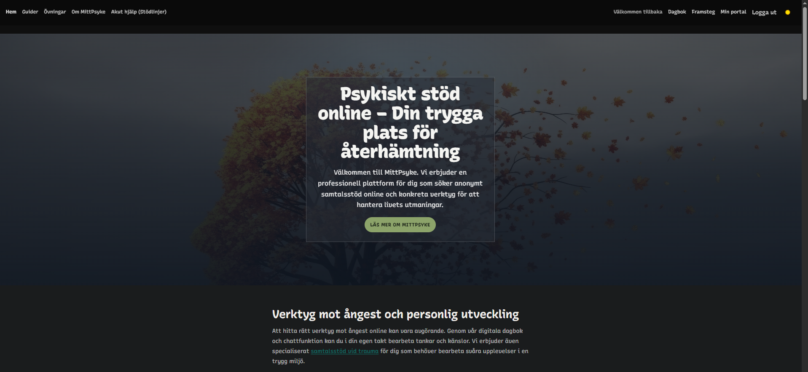
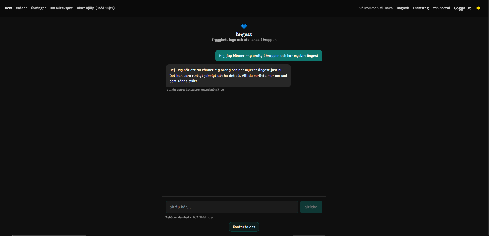
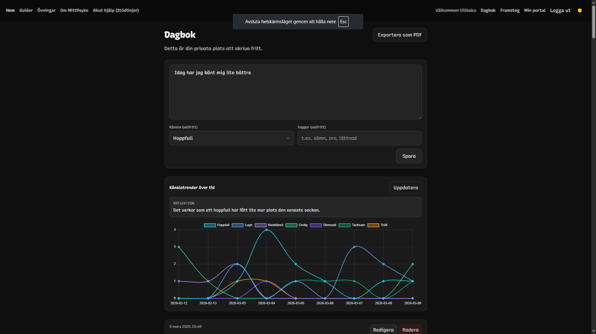
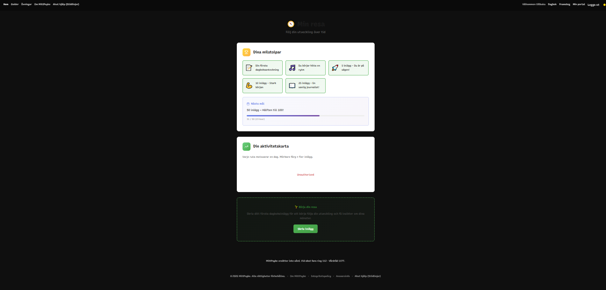

# 🧠 MittPsyke


MittPsyke is a Swedish mental wellbeing platform where users can talk anonymously with AI, write a personal diary, track emotional progress, and find support lines.

---

## 🌐 Demo

Live site:  
https://www.mittpsyke.se

---

## 📸 Screenshots

### Home
<p align="center">
  
</p>

### Chat
<p align="center">
  
</p>

### Diary
<p align="center">
  
</p>

### Progress
<p align="center">
  
</p>

---

## ✨ Features

- **AI conversation support**  
  Anonymous AI-guided conversations for reflection and emotional support.

- **Diary journaling**  
  Personal diary entries for thoughts, feelings, and everyday events.

- **Progress tracking**  
  Streaks, milestones, and charts to follow emotional patterns over time.

- **Support lines**  
  Quick access to important support contacts.

---

## 🧩 Tech Stack

### Frontend
- SvelteKit
- TailwindCSS
- Chart.js

### Backend
- Supabase
- PostgreSQL

### AI
- OpenAI API

### Deployment
- Vercel

---

## ⚙️ Installation

```bash
git clone <repo-url>
cd mittpsyke-main
npm install
npm run dev
```

---

## 🔐 Security

- Supabase authentication
- Row Level Security (RLS)
- HTTPS

---

## ⚠️ Disclaimer

MittPsyke is a digital support tool and is not a replacement for professional healthcare, therapy, or medical advice. In emergencies, call **112**.
